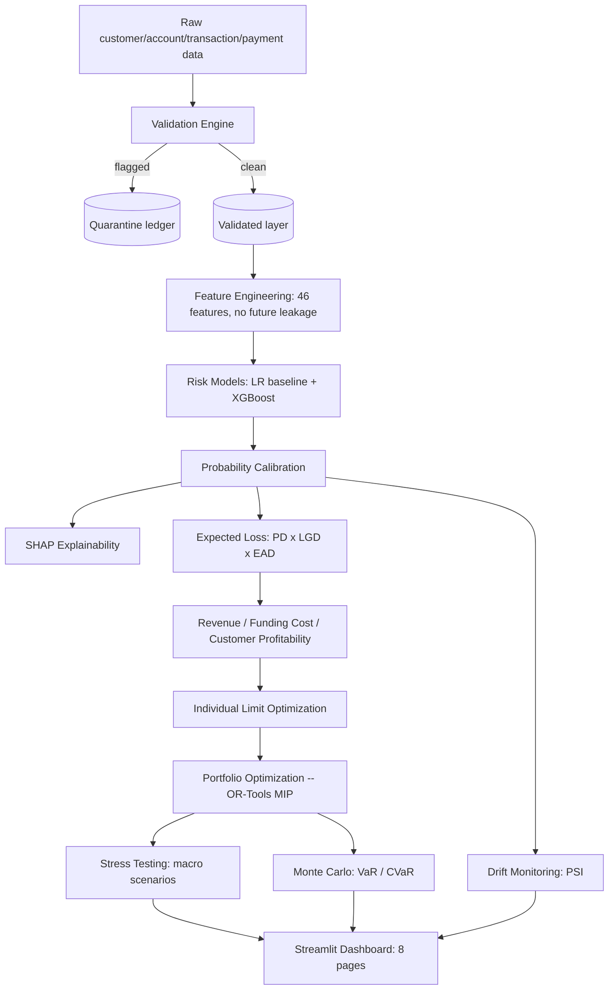
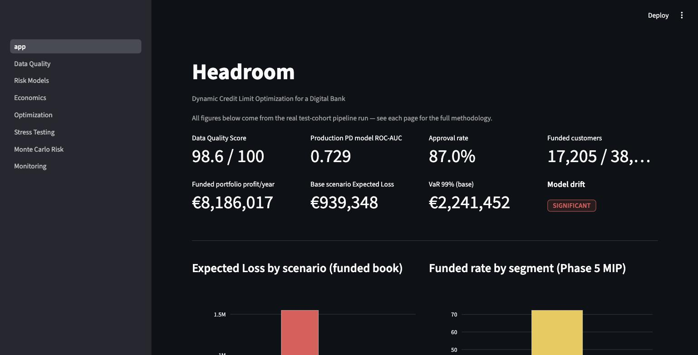
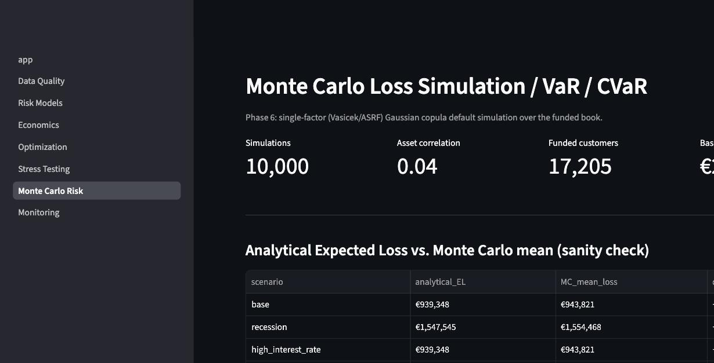
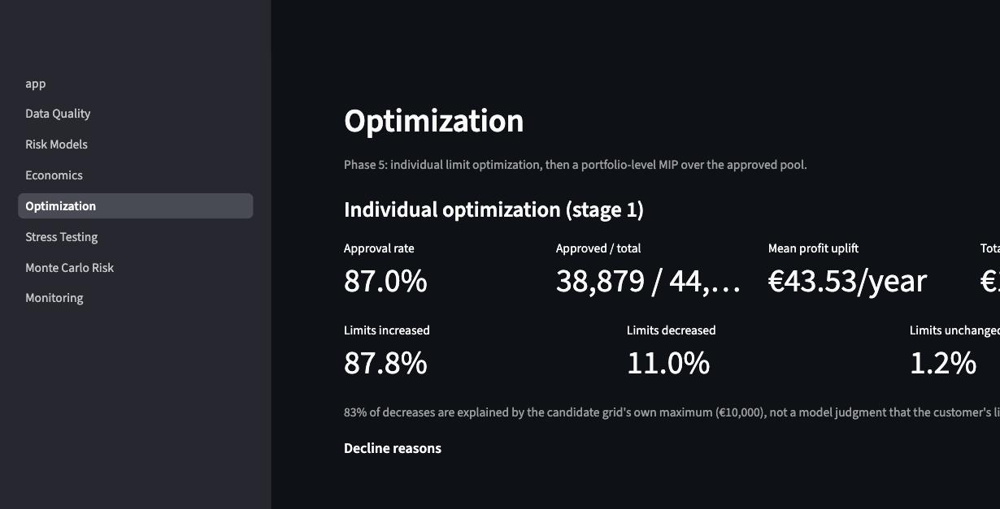

# Headroom

**Dynamic Credit Limit Optimization for a Digital Bank**

An end-to-end credit-risk decision platform: it validates messy customer/transaction
data, models probability of default and expected loss, prices customer profitability,
optimizes credit limits — per customer and across the portfolio — subject to risk and
exposure constraints, then stress-tests, Monte-Carlo-simulates and monitors the
resulting book for drift.

Every number in this README comes from an actual run of the pipeline (`make all`,
seed=42). Nothing here is fabricated or hand-typed to look good — where a result was
a real bug, a documented simplification, or a surprising-but-explained finding,
that's said explicitly below and in `CLAUDE.md`, not smoothed over.

## Why this exists

A digital bank issuing unsecured revolving credit has to answer three questions
before it can grow responsibly: *who* should get credit, *how much*, and *what
happens to the book under stress?* This project builds that whole chain — validate
data, model risk, price profitability, optimize limits under real constraints,
stress-test the result, and monitor it for drift — as working software with a
dashboard on top, not a slide deck.

## Architecture



Raw data never gets silently edited — every record that fails validation moves to
quarantine with a full lineage trail, and the validated layer downstream is exactly
`raw − quarantined`. Every stochastic step (data generation, calibration, Monte
Carlo) takes its seed from `config/settings.yaml`; every threshold/constant lives
there too, nothing hardcoded in `src/`.

## Results

| | |
|---|---|
| Data Quality Score | **98.6 / 100** (customers 96.4, accounts 96.6, transactions 98.5, payments 99.1) |
| Records quarantined | **77,201** of ~6.27M raw rows across 4 datasets (CRITICAL/HIGH severity only) |
| PD models (test ROC-AUC) | LR baseline **0.724** · XGBoost (production) **0.730** — calibrated Brier 0.043, ECE 0.0016 (two orders of magnitude better than raw) |
| Portfolio Expected Loss | **€939,348**/year (test cohort, mean PD 3.56%, mean LGD by segment 0.55/0.70/0.85) |
| Individual approval rate | **87.0%** — declines driven almost entirely by the risk constraint |
| Portfolio funding (OR-Tools MIP) | **17,205 of 38,879** approved customers funded (44.3%), **€8.19M/year** profit — 7.77% better than a greedy heuristic |
| Stress test (recession scenario) | Mean PD **+64%**, Expected Loss **+65%** vs. base — re-scored through the real calibrated model, not a hand formula |
| Monte Carlo (base scenario) | VaR 99% **€2.24M** vs. Expected Loss €939K (2.4x) — MC mean within **0.5%** of the analytical EL on every scenario |
| Drift monitoring | PD score **STABLE** across all 3 real snapshot vintages; one explained exception (see below) |
| Tests | **227/227 passing** |

The full per-phase breakdown — methodology, exact figures, and every bug found and
fixed while building each stage — lives in `CLAUDE.md`; the highlights are below.

## How it works

### 1. Synthetic data & validation (`src/credit_limit_optimizer/data/`)

50,000 customers (prime/near_prime/subprime), 36 months of history, ~4.3M
transactions, 1.8M behavior/payment rows. Three real calibration bugs were found and
fixed while building the generator: balance never reaching equilibrium (pinned at the
credit ceiling for 34% of customer-months), subprime specifically staying pinned even
after that fix, and an AR(1) "distress" shock whose naive parametrization shrank
variance instead of holding it constant. The validation engine (schema, completeness,
duplicates, validity, referential integrity) quarantines CRITICAL/HIGH issues with a
full lineage trail; RAW − QUARANTINED = VALIDATED exactly, verified in tests.

### 2. Feature engineering & risk models (`features/`, `models/`)

46 features (income, credit, behavioral, delinquency, liquidity, trend/growth
windows), built with pandas `rolling()`/`shift()` over each customer's own
chronologically-sorted history so a feature at snapshot month M is structurally
incapable of seeing month M+1. Time-based train/validation/test cohorts (months
12/18/24 — a real credit-risk "vintage" out-of-time design, not a random split).

Logistic Regression (interpretable baseline, correlation-pruned at 0.93 after a real
multicollinearity bug made its coefficients contradict the EDA) and XGBoost
(production PD source, beats the baseline 0.730 vs. 0.724 ROC-AUC after fixing an
early-stopping-metric bug that let it overfit). Both are calibrated
(`CalibratedClassifierCV(FrozenEstimator(...))`) — raw mean predicted probability
~42-48% collapses to ~5% after calibration, matching the true ~4.8% base rate almost
exactly. SHAP (`TreeExplainer`/`LinearExplainer`) explains both models on a
2,000-row sample; a genuine multicollinearity artifact (`cash_buffer` showing up
*positively* correlated with risk, backwards from intuition) was found and fixed by
tightening the correlation-pruning threshold.

### 3. Economics (`models/expected_loss.py`, `revenue_model.py`, `funding_cost.py`, `profitability.py`)

Expected Loss = PD (calibrated XGBoost) × LGD (segment lookup: prime 0.55 / near_prime
0.70 / subprime 0.85) × EAD (a genuine regression model on `future_utilization`, not a
formula dressed up as one — `credit_exposure` had ~0 importance in it, since this
generator never varies a customer's limit historically). Revenue and Funding Cost
validated against the generator's own forward-looking labels to the cent. Customer
Profitability introduces the balance-response-to-candidate-limit model
(`balance(L) = min(current_balance × (L/current_limit)^0.3, L)`, anchored exactly at
each customer's own observed point) that everything downstream reuses.

### 4. Optimization (`optimization/`)

**Individual** (`customer_optimizer.py`): per-customer argmax over a €500-€10,000
candidate grid under income/risk/utilization/DSR constraints — 87.0% approved, and a
real tie-breaking bug (flat-profit customers silently getting recommended down to the
smallest grid value) was found and fixed to break toward the customer's current
limit instead.

**Portfolio** (`portfolio_optimizer.py`): OR-Tools CBC MIP, a 0/1 knapsack over the
~38,900 individually-approved customers under exposure/loss/risk-concentration
budget constraints. Funding every approved customer would need €320.5M exposure
against a €150M limit — a genuinely binding problem, not a rubber stamp. MIP-optimal
funds 17,205 (44.3%) for €8.19M/year, 7.77% better than a greedy heuristic. **Not
"safest first"**: prime (safest) gets funded LEAST (20%) because exposure is the
binding constraint and prime's profit-per-euro-of-exposure is the segment's worst.

### 5. Risk management (`simulation/`, `monitoring/`)

**Stress testing** re-scores the FUNDED book's PD through the real calibrated model
under shocked income/spend/volatility/delinquency features (not a hand formula), plus
direct overlays for macro rate/APR shocks. A real finding: the `high_interest_rate`
scenario's net profit exactly matches base to the cent — equal-magnitude
`funding_rate_shift` and `apr_shift` cancel in net profit even though gross revenue
and cost both move by ~€1M.

**Monte Carlo** runs a single-factor (Vasicek/ASRF) Gaussian copula default
simulation, 10,000 draws, asset correlation 0.04 (Basel's own flat constant for
credit-card-type exposures, not fit to this data). MC mean loss lands within 0.5% of
the analytical Expected Loss on every scenario; VaR 99% is 2.4x Expected Loss even at
this modest correlation.

**Drift monitoring** computes PSI across the three real, time-separated snapshot
vintages. PD score is stable throughout. `delinquency_count` shows SIGNIFICANT PSI,
but this is a vintage-design artifact, not real population drift: train/validation/
test are the SAME 50,000 customers observed later in their own history, so a
cumulative counter mechanically accumulates more events — confirmed by
`days_past_due` and `recent_delinquency` (both non-cumulative) staying stable.

## Dashboard

8 pages, reading `reports/outputs/*.json` (what `make all` already produced) rather
than recomputing the pipeline per click — Phase 3's model training and Phase 6's
Monte Carlo simulation alone would make the UI unusable otherwise.

<p align="center">
  
  
  
</p>

Executive Overview (shown above) · Data Quality · Risk Models (LR/XGBoost/
calibration/SHAP) · Economics · Optimization (shown above) · Stress Testing ·
Monte Carlo Risk (shown above) · Monitoring.

## Verification

Before calling Phase 7 done, the full pipeline was re-run end to end with
`make all` (data generation through drift monitoring, seed=42) and the dashboard was
opened live and walked through page by page in a browser. Every stage reproduced the
figures documented above, and **227/227 tests passed** (215 pipeline tests + 12
dashboard tests, the latter run headlessly via Streamlit's `AppTest` harness — no
browser required under `pytest`). See `CLAUDE.md` for the full list of real bugs
found and fixed during development, phase by phase — left visible on purpose, since
finding and fixing them honestly is the actual engineering content of this project.

## Tech stack

Python 3.11+ · pandas, numpy, scipy · scikit-learn, XGBoost, SHAP · Plotly,
Streamlit, matplotlib · OR-Tools · pytest

## Installation

```bash
git clone <repo-url> headroom
cd headroom
python3 -m venv .venv && source .venv/bin/activate
make install
make all          # full pipeline: data -> quality -> risk -> economics -> optimize -> simulate -> stress -> monitor -> test
make dashboard    # streamlit run app/app.py
```

Individual stages: `make generate-data`, `make validate-data`, `make quality-report`,
`make eda`, `make features`, `make train`, `make train-xgboost`, `make calibrate`,
`make explain`, `make expected-loss`, `make economics`, `make optimize-customer`,
`make optimize-portfolio`, `make simulate`, `make stress`, `make monitor`, `make test`.

## Project structure

```text
headroom/
├── src/credit_limit_optimizer/
│   ├── data/            # generation, ingestion, validation, quality reporting
│   ├── features/        # feature engineering (46 features, no leakage)
│   ├── analysis/         # EDA
│   ├── models/            # LR, XGBoost, calibration, SHAP, EL, revenue, funding, profitability
│   ├── optimization/       # individual (argmax) + portfolio (OR-Tools MIP)
│   ├── simulation/          # stress testing (scenarios) + Monte Carlo VaR/CVaR
│   ├── monitoring/           # PSI drift monitoring
│   └── utils/                 # config loader, logging
├── app/                        # Streamlit dashboard (8 pages)
├── config/settings.yaml         # every constant/threshold/seed, nothing hardcoded
├── tests/                        # 227 tests
├── reports/{outputs,figures,model_cards}/  # pipeline artifacts, gitignored
├── data/{raw,processed,quarantine}/          # RAW -> VALIDATED -> QUARANTINED, gitignored
└── CLAUDE.md                                   # detailed engineering log: every decision and bug, with why
```

## Limitations

- **Synthetic data.** Realistic in structure and internally consistent (calibrated
  against known credit-risk patterns), but not real customer data.
- **PD held constant across candidate limits.** This generator never varies a
  customer's historical credit limit, so no model has ever seen the counterfactual
  needed to estimate a genuine limit-response for PD or EAD — documented, not hidden.
- **Balance-to-limit elasticity (0.3) is a documented assumption**, not fit from
  data, for the same reason.
- **Stress scenarios don't shock `average_balance` or LGD** — no causal model exists
  for either, and the spec's own scaffolded config has no LGD shock key.
- **Monte Carlo uses a single systemic factor** (Basel's own QRRE correlation), not a
  multi-factor model with segment-specific correlations.
- **No true production data exists past the test cohort's month-24 snapshot** — drift
  monitoring compares real, time-separated vintages instead, with the vintage-reuse
  caveat documented above for cumulative features.

## Future improvements

Real bureau/transaction data integration, a proper database backend instead of CSVs,
a reactive (not static) portfolio policy that re-optimizes as the book ages, a
multi-factor Monte Carlo model, real-time monitoring with alerting, MLflow model
tracking, cloud deployment.

---

*Built as a portfolio project demonstrating end-to-end credit-risk engineering: from
raw, imperfect customer data to a validated, priced, optimized, stress-tested and
monitored credit decision system.*
